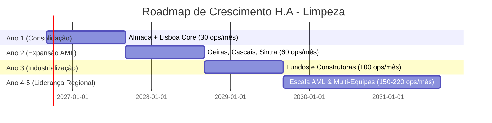

# H.A - Limpeza | Plano de Negócios (5 Anos)
**Property Readiness & Asset Care**  
*Plano Estratégico de Escala Operacional e Financeira*

---

## 1. Missão, Visão e Valores

### 1.1. Missão
Preparar e preservar ativos imobiliários com rigor técnico e garantia auditável, acelerando transações, valorizando carteiras de clientes e reduzindo custos com períodos de vacatura.

### 1.2. Visão
Tornar-se a referência número um na Área Metropolitana de Lisboa em **Property Readiness B2B**, sendo o parceiro operacional mandatado pelas maiores redes de mediação, construtoras e fundos institucionais.

### 1.3. Pilares Estratégicos
- **Rigor Técnico e Processo Normalizado:** Checklists uniformes e evidência digital em cada fração.
- **Previsibilidade de Custos:** Matriz tarifária transparente sem orçamentos morosos.
- **Velocidade de Resposta:** Capacidade de alocação prioritária em 24h para emergências comerciais.
- **Foco no Retorno do Cliente:** Cada euro investido na preparação traduz-se em redução de vacatura e valorização na transação.

---

## 2. Análise de Mercado e Clientes-Alvo

### Segmentos de Clientes B2B:
1. **Redes de Mediação Imobiliária & Consultores Independentes:**
   - *Necessidade:* Imóveis limpos, desodorizados e fotogénicos para publicidade e visitas.
   - *Ponto de Venda:* Aumenta a taxa de conversão da visita em proposta e justifica comissões plenas.
2. **Construtoras, Empreiteiros e Promotores Imobiliários:**
   - *Necessidade:* Entrega impecável no término da obra, sem resíduos nem poeiras em suspensão.
   - *Ponto de Venda:* Evita recusas de receção de obra e custos com retrabalho.
3. **Gestores de Ativos, Fundos de Investimento e Servicers:**
   - *Necessidade:* Manutenção de dezenas/centenas de frações desocupadas e prontas a transacionar.
   - *Ponto de Venda:* Vistorias com prova fotográfica quinzenal e preservação preventiva do imóvel.
4. **Proprietários Particulares e Investidores em Alojamento Local / Arrendamento:**
   - *Necessidade:* Rápida rotação entre contratos de arrendamento com padrão hoteleiro.

---

## 3. Modelo Operacional & Unit Economics

### 3.1. Estrutura de Custos Diretos por Intervenção (Base Realista - T2 / 420€ Ticket Médio)
- **Mão de Obra Técnica Direta:** 2 técnicos × 4 horas = 8 horas de trabalho.
  - Custo carregado de MO: 8 h × 14,00 €/h = **112,00 €**
- **Consumíveis e Produtos Químicos Específicos:** **25,00 €**
- **Deslocação Logística (25 km médios × 0,40 €/km):** **10,00 €**
- **Portagens e Estacionamento:** **4,50 €**
- **Seguro de Responsabilidade Civil e Rateio de Equipamentos:** **10,00 €**
- **Custo Direto Total (COGS):** **161,50 €**
- **Lucro Bruto por Intervenção:** 420,00 € - 161,50 € = **258,50 €**
- **Margem Bruta Percentual:** **61,5%**

---

## 4. Projeções Financeiras Plurianuais (Cenário Realista)

| Métrica Financeira | Ano 1 | Ano 2 | Ano 3 | Ano 4 | Ano 5 |
| :--- | :---: | :---: | :---: | :---: | :---: |
| **Intervenções / Mês** | 30 | 60 | 100 | 150 | 220 |
| **Intervenções / Ano** | 360 | 720 | 1.200 | 1.800 | 2.640 |
| **Ticket Médio** | 420 € | 420 € | 420 € | 420 € | 420 € |
| **Receita Bruta Anual** | **151.200 €** | **302.400 €** | **504.000 €** | **756.000 €** | **1.108.800 €** |
| **Custos Diretos (COGS ~38,5%)** | 58.140 € | 116.280 € | 193.800 € | 290.700 € | 426.360 € |
| **Margem Bruta (61,5%)** | **93.060 €** | **186.120 €** | **310.200 €** | **465.300 €** | **682.440 €** |
| **Custos Fixos e Operacionais** | 36.000 € | 65.000 € | 110.000 € | 165.000 € | 230.000 € |
| **EBITDA Operacional Estimado** | **57.060 €** | **121.120 €** | **200.200 €** | **300.300 €** | **452.440 €** |
| **Margem EBITDA** | **37,7%** | **40,1%** | **39,7%** | **39,7%** | **40,8%** |

---

## 5. Análise de Sensibilidade & Cenários

- **Cenário Conservador:**  
  - Ano 1: 120.000 € | Ano 2: 220.000 € | Ano 3: 350.000 € | Ano 4: 520.000 € | Ano 5: 700.000 €
- **Cenário Realista (Base):**  
  - Ano 1: 151.200 € | Ano 2: 302.400 € | Ano 3: 504.000 € | Ano 4: 756.000 € | Ano 5: 1.108.800 €
- **Cenário Agressivo:**  
  - Ano 1: 180.000 € | Ano 2: 420.000 € | Ano 3: 720.000 € | Ano 4: 1.100.000 € | Ano 5: 1.600.000 €

---

## 6. Governação e Fases de Desenvolvimento Técnico

1. **Sprint 1 — Landing Page, Branding & SEO Institucional** (Concluído)
2. **Sprint 2 — Simulador Comercial & Motor de Margens** (Concluído)
3. **Sprint 3 — Painel de Gestão de Preçário e Configurações** (Concluído)
4. **Sprint 4 — Módulo de Captação e CRM de Leads B2B**
5. **Sprint 5 — Dashboard de Alocação de Equipas e Rotas na AML**
6. **Sprint 6 — Portal do Cliente B2B (Faturas, Relatórios de Entrega com Fotos)**
7. **Sprint 7 — Aplicação Mobile para Técnicos de Campo com Validação Offline**
