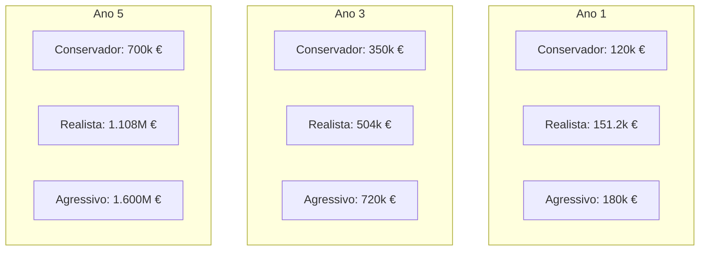

# H.A - Limpeza | Projeções Financeiras e Modelo de Rentabilidade (5 Anos)
**Property Readiness & Asset Care**  
*Demonstração de Resultados Previsional e Análise de Rentabilidade*

---

## 1. Premissas de Modelagem

1. **Ticket Médio Ponderado:** 420,00 € por intervenção (mix entre Property Prep, Renovation e Ready to Occupy).
2. **COGS Médio (Custos Diretos):** 38,5% da receita bruta (161,50 € por intervenção).
3. **Margem Bruta:** 61,5% (258,50 € por intervenção).
4. **Base Operacional:** Almada (sede/armazém), cobrindo toda a Área Metropolitana de Lisboa.

---

## 2. Cenário Realista (Base Case)

| Rubrica Financeira | Ano 1 | Ano 2 | Ano 3 | Ano 4 | Ano 5 |
| :--- | :---: | :---: | :---: | :---: | :---: |
| **Volume Mensal Médio** | 30 ops | 60 ops | 100 ops | 150 ops | 220 ops |
| **Volume Anual Total** | 360 ops | 720 ops | 1.200 ops | 1.800 ops | 2.640 ops |
| **Receita Bruta Total** | **151.200 €** | **302.400 €** | **504.000 €** | **756.000 €** | **1.108.800 €** |
| Custos Diretos - Mão de Obra | (40.320 €) | (80.640 €) | (134.400 €) | (201.600 €) | (295.680 €) |
| Custos Diretos - Consumíveis | (9.000 €) | (18.000 €) | (30.000 €) | (45.000 €) | (66.000 €) |
| Custos Diretos - Frota & Portagens | (5.220 €) | (10.440 €) | (17.400 €) | (26.100 €) | (38.280 €) |
| Custos Diretos - Seguros & Outros | (3.600 €) | (7.200 €) | (12.000 €) | (18.000 €) | (26.400 €) |
| **Custo das Vendas (COGS)** | **(58.140 €)** | **(116.280 €)** | **(193.800 €)** | **(290.700 €)** | **(426.360 €)** |
| **Margem Bruta (€)** | **93.060 €** | **186.120 €** | **310.200 €** | **465.300 €** | **682.440 €** |
| *Margem Bruta (%)* | *61,5%* | *61,5%* | *61,5%* | *61,5%* | *61,5%* |
| Instalações, Rendas & Armazém | (12.000 €) | (18.000 €) | (24.000 €) | (30.000 €) | (36.000 €) |
| Marketing B2B & Captação | (8.400 €) | (14.400 €) | (24.000 €) | (36.000 €) | (48.000 €) |
| Software, ERP & Comunicações | (3.600 €) | (6.000 €) | (9.600 €) | (14.400 €) | (19.200 €) |
| Gestão Operacional & Supervisão | (12.000 €) | (26.600 €) | (52.400 €) | (84.600 €) | (126.800 €) |
| **Custos Fixos / Operacionais (OPEX)** | **(36.000 €)** | **(65.000 €)** | **(110.000 €)** | **(165.000 €)** | **(230.000 €)** |
| **EBITDA Operacional** | **57.060 €** | **121.120 €** | **200.200 €** | **300.300 €** | **452.440 €** |
| *Margem EBITDA (%)* | *37,7%* | *40,1%* | *39,7%* | *39,7%* | *40,8%* |

---

## 3. Comparativo de Cenários (Receita Anual)

---

## 4. Ponto Crítico de Equilíbrio (Break-Even Point)

- **Custos Fixos Mensais (Ano 1):** 3.000 € / mês.
- **Margem de Contribuição Unitária:** 258,50 € / intervenção.
- **Ponto de Equilíbrio (Break-Even Operacional):**
  $$\text{Break-Even} = \frac{3.000\text{ €}}{258,50\text{ €}} \approx \mathbf{11,6\text{ intervenções / mês}}$$
- **Conclusão:** A partir de apenas 12 intervenções mensais (3 por semana), a operação atinge o break-even financeiro integral.
